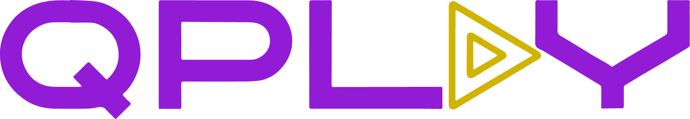

<div align='center'>
    <h1><b>⭐ QPLAY ⭐</b></h1>
    
</div>

# ⚡ About the project
QPlay is an innovative company that offers a digital solution for the traditional queueing problem in clubs, bars, and pubs.  
We see ourselves as a kind of digital jukebox, allowing users to manage their place in the queue comfortably from their  
smartphone, while having the freedom to use their time as they wish.   
Our goal is to make nightlife simpler and more enjoyable.  

# ⚙️ Setup the Project
Hello together, this is a step-by-step tutorial on how to setup our project.   
You should have npm installed locally or, if you like to run the project in a container, Docker.  

Also you can have a look at the feature on our youtube video:  
Link: https://youtu.be/i5cCg4dqR34  

## Native MacOS
1. clone the project and navigate with a terminal to the project folder
2. navigate to subfolder *backend/*
3. install all dependencies with *npm i*
4. start backend with *npm run startLocal*
5. there should be no error and the backend is up and running
6. open a new terminal tab or window
7. navigate to the *qplay/frontend/* folder
8. install all dependencies with run *npm i*
9. run *npm run runLocal*
10. there should be no error and the frontend is up and running
11. qplay front- and backend is now running, and you are ready to go
## Native Windows
1. clone the project and navigate with a CMD to the project folder
2. copy the *.env* file from the project folder to the *frontend/* and *backend/* folder
3. navigate to subfolder *backend/*
4. install all dependencies with *npm i*
5. start backend with *npm run start*
6. there should be no error and the backend is up and running
7. open a new CMD tab or window
8. navigate to the *qplay/frontend/* folder
9.  install all dependencies with run *npm i*
10. run *npm run dev*
11. there should be no error and the frontend is up and running
12. qplay front- and backend is now running, and you are ready to go
## Run Docker
1. make sure Docker is running
2. clone the project and navigate with a terminal to the project folder
3. use *docker-compose up --build* to run the Project
4. there should be no errors
5. qplay front- and backend is running and you are ready to go

# 🖥️ How to use qplay
This is a tutorial about how to use qplay.
qplay can be separated in two areas, the Host and User area.
## Host area
The host area is the area where you can create and control events. You can access it under the url *http://localhost:6969/*<br> The first page shows a login. The login is fully functional and can be used. If you do not have an account create one otherwise just log in. <br> After logging in, you see the main navigation bar at the top. On the "Host data" tab you can change the account data, like email or name. The "Create event" tab is pre-selected, here you can create a new event. The "Show event" is an overview of the created events. <br> Go on and create an event. After that you will be directed to the event overview. Depending on the period of the event it is active or not. If the event is active, you can create a voting or auction. The user can access it with the event id. Use the QR-Code, which can be shown with the icon on the lower left side or copy the event id from the url. <br> Go on and play around with the features, everything is designed to be intuitive.
## User area
The user area is light weight. There is no account. The best way to test the page is useing a different browser than the host, otherwise there are some differences like the logout button, which is not shown in a normal case. You can access the user view of an event with the following url: *http://localhost:6969/user/event-overview/[event_id]* (pass in the event id, best way is to copy it directly from the host view url). <br>
On the page you can make suggestions and participate on the activities started by the event host. The Payment works with PayPal. Here are credentials for the sandbox:
```
    PayPal sandbox account: sb-7rgfa26558732@personal.example.com´
    password: 12345678
```
# 📊 Entity Relationship Diagram


# 📱 Description for Routes
## Event Route
---
### **Create Event**
---
#### Request:

    POST 127.0.0.1:6868/api/event/create/:email

#### Request Header:

    Authorization : Bearer <token>

#### Request Parameter:

| Attribute             | Type    | Required | Description             |
| --------------------- | ------- | -------- | ----------------------- |
| `email`               | string  | yes      | user email              |

#### Request Body:

| Attribute             | Type    | Required | Description             |
| --------------------- | ------  | -------- | ----------------------- |
| `title`               | string  | yes      | title                   |
| `longitude`           | number  | yes      | longitude               |
| `latitude`            | number  | yes      | latitude                |
| `description`         | string  | yes      | description             |
| `start`               | Date    | yes      | start of event          |
| `end`                 | Date    | yes      | end of event            |
| `private`             | boolean | yes      | event private           |
| `messagePrice`        | number  | yes      | price of messages       |
| `songSuggestionPrice` | number  | yes      | price ofsuggestions     |

#### Response Codes:

| Status | Type  | Message                             |
| ------ | ----- | ----------------------------------- |
| `403`  | error | "unauthorized call"                 |
| `404`  | error | "host not found"                    |
| `201`  | ok    | event object                        |

#### Response Example:
    {
        _id: "129DNDKJ83"
        title: "Event Title",
        longitude: 10.909,
        latitude: 53.13,
        description: "Description",
        start: 2023-08-12T13:11:57.000+00:00,
        end: 2023-08-26T13:11:57.000+00:00,
        private: true,
        messagePrice: 1,
        songSuggestionPrice: 1,
    }

---
### **Update an event**
---
#### Request:

    PUT 127.0.0.1:6868/api/event/:id

#### Request Header:

    Authorization: Bearer <token>

#### Request Parameter: 

| Attribute             | Type    | Required | Description             |
| --------------------- | ------- | -------- | ----------------------- |
| `id`                  | string  | yes      | event id                |

#### Request Body:

| Attribute             | Type    | Required | Description             |
| --------------------- | ------- | -------- | ----------------------- |
| `title`               | string  | no       | title                   |
| `longitude`           | number  | no       | longitude               |
| `latitude`            | number  | no       | latitude                |
| `description`         | string  | no       | description             |
| `start`               | string  | no       | start of event          |
| `end`                 | string  | no       | end of event            |
| `private`             | boolean | no       | event private           |
| `messagePrice`        | number  | no       | config msg price        |
| `songSuggestionPrice` | number  | no       | config suggestion price |

#### Response Codes:

| Status | Type  | Message                             |
| ------ | ----- | ----------------------------------- |
| `403`  | error | "unauthorized call"                 |
| `404`  | error | "no event found"                    |
| `200`  | ok    | updated event object                |

#### Response Example:

    {
        "_id": "2329DJKJS",
        "title": "Event Title",
        "longitude": 10.909,
        "latitude": 53.13,
        "description": "Description",
        "start": 2023-08-12T13:11:57.000+00:00,
        "end": 2023-08-26T13:11:57.000+00:00,
        "private": true,
        "messagePrice": 1,
        "songSuggestionPrice": 1
    }

---
### **Get an event**
---
#### Request:

    GET 127.0.0.1:6868/api/event/data/info/:id

#### Request Parameter: 

| Attribute             | Type    | Required | Description             |
| --------------------- | ------- | -------- | ----------------------- |
| `id`                  | string  | yes      | event id                |

#### Response Codes:

| Status | Type  | Message                             |
| ------ | ----- | ----------------------------------- |
| `404`  | error | "no event found"                    |
| `200`  | ok    | event object                        |

#### Response example:

    {
        "_id": "2329DJKJS",
        "title": "Event Title",
        "longitude": 10.909,
        "latitude": 53.13,
        "description": "Description",
        "start": 2023-08-12T13:11:57.000+00:00,
        "end": 2023-08-26T13:11:57.000+00:00,
        "private": true,
        "messagePrice": 1,
        "songSuggestionPrice": 1
    }

---
### **Get votes for an event**
---
#### Request:

    GET 127.0.0.1:6868/api/event/data/vote/:id

#### Request Parameter: 

| Attribute             | Type    | Required | Description             |
| --------------------- | ------- | -------- | ----------------------- |
| `id`                  | string  | yes      | event id                |

#### Response Codes:

| Status | Type  | Message                             |
| ------ | ----- | ----------------------------------- |
| `404`  | error | "no event found"                    |
| `200`  | ok    | event with votes object             |

#### Response Example:

    {
        "_id": "2329DJKJS",
        "title": "Event Title",
        "longitude": 10.909,
        "latitude": 53.13,
        "description": "Description",
        "start": 2023-08-12T13:11:57.000+00:00,
        "end": 2023-08-26T13:11:57.000+00:00,
        "private": true,
        "messagePrice": 1,
        "songSuggestionPrice": 1,
        "voteActivities": [
            {
                "_id":
                "start": 2023-08-12T13:11:57.000+00:00,
                "end": 2023-08-26T13:11:57.000+00:00,
                "voteOptions": [
                    {
                        "_id": "SNJSJKJH838"
                        "songId": "JHSKJKEH82"
                        "count": 0
                    },
                    {
                        "_id": "SNJSJKJH839"
                        "songId": "JHSKJKEF8"
                        "count": 0
                    },
                ],
            },
        ],    
    }

---
### **Get auctions for an event**
---
#### Request:

    GET 127.0.0.1:6868/api/event/data/auction/:id

#### Request Parameter: 

| Attribute             | Type    | Required | Description             |
| --------------------- | ------- | -------- | ----------------------- |
| `id`                  | string  | yes      | event id                |

#### Response Codes:

| Status | Type  | Message                             |
| ------ | ----- | ----------------------------------- |
| `404`  | error | "no event found"                    |
| `200`  | ok    | event with auction object           |

#### Response Example:

    {
        "_id": "2329DJKJS",
        "title": "Event Title",
        "longitude": 10.909,
        "latitude": 53.13,
        "description": "Description",
        "start": 2023-08-12T13:11:57.000+00:00,
        "end": 2023-08-26T13:11:57.000+00:00,
        "private": true,
        "messagePrice": 1,
        "songSuggestionPrice": 1,
        "auctionActivities": [
            {
                "_id":
                "start": 2023-08-12T13:11:57.000+00:00,
                "end": 2023-08-26T13:11:57.000+00:00,
                "startPrice": 10
                "bets": [
                    {
                        "_id": "SNJSJKJH838"
                        "songId": "JHSKJKEH82"
                        "paymentId": "SJKJSJK821"
                        accepted: false
                    },
                    {
                        "_id": "SNJSJKJH808"
                        "songId": "JHSKJKEH72"
                        "paymentId": "SJKJSAK821"
                        accepted: false
                    },
                ],
            },
        ],    
    }

---
### **Get suggestions for an event**
---
#### Request:

    GET 127.0.0.1:6868/api/event/data/suggestion/:id

#### Request Header:

    Authorization: Bearer <token>

#### Request Parameter: 

| Attribute             | Type    | Required | Description             |
| --------------------- | ------- | -------- | ----------------------- |
| `id`                  | string  | yes      | event id                |

#### Response Codes:

| Status | Type  | Message                             |
| ------ | ----- | ----------------------------------- |
| `403`  | error | "unauthorized call"                 |
| `404`  | error | "no event found"                    |
| `200`  | ok    | event with suggestions object       |

#### Response Example:

    {
        "_id": "2329DJKJS",
        "title": "Event Title",
        "longitude": 10.909,
        "latitude": 53.13,
        "description": "Description",
        "start": 2023-08-12T13:11:57.000+00:00,
        "end": 2023-08-26T13:11:57.000+00:00,
        "private": true,
        "messagePrice": 1,
        "songSuggestionPrice": 1,
        "suggestions": [
            {
                _id: "2329DJKJSSKN"
                songId: "JHSKJKEH72",
                message: "Hallo!",
                paymentId: "JHSKJKEH72SS2",
                refundId: "JHSKJKEH72SS212",
                accepted: false,
                price: 10,
                suggestedAt: 2023-08-12T13:11:57.000+00:00,
                boosted: true,
                refunded: false,
            },
        ],    
    }

---
### **Delete an event**
---
#### Request:

    DELETE 127.0.0.1:6868/api/event/:id

#### Request Header:

    Authorization: Bearer <token>

#### Request Parameter:

| Attribute     | Type   | Required | Description                       |
| ------------- | ------ | -------- | --------------------------------- |
| `id`          | string | yes      | id of the event                   |


#### Response Codes:

| Status | Type  | Message                             |
| ------ | ----- | ----------------------------------- |
| `403`  | error | "unauthorized call"                 |
| `404`  | error | "host not found"                    |
| `204`  | ok    | "event successfully deleted"        |

## Spotify
---
### **Track information**
---
#### Request:

    GET 127.0.0.1:6868/api/spotify/track/:id

#### Request Parameter:

| Attribute | Type   | Required | Description      |
| --------- | ------ | -------- | ---------------- |
| `id`      | string | yes      | Spotify track id |

#### Response Example:

    {
      "images": [
          {
              "height": 640,
              "url": "https://i.scdn.co/image/ab67616d0000b2731a3a478593cd9546cf08ff1b",
              "width": 640
          },
          {
              "height": 300,
              "url": "https://i.scdn.co/image/ab67616d00001e021a3a478593cd9546cf08ff1b",
              "width": 300
          },
          {
              "height": 64,
              "url": "https://i.scdn.co/image/ab67616d000048511a3a478593cd9546cf08ff1b",
              "width": 64
          }
      ],
      "id": "6HGleB7bjIUe6TtPK6JlIi",
      "name": "¿ Warum ?",
      "artists": [
          "Gzuz"
      ]
    }

---
### **Multiple Tracks Information**
---
#### Request:

    GET 127.0.0.1:6868/api/spotify/tracks/:id

#### Parameters:
| Attribute | Type   | Required | Description       |
| --------- | ------ | -------- | ----------------- |
| `id`      | string | yes      | spotify track id  |

#### Response Example:

    [
      {
        "images": [
          {
              "height": 640,
              "url": "https://i.scdn.co/image/ab67616d0000b273d076ec9e67fadcb4eb2c628c",
              "width": 640
          },
          {
              "height": 300,
              "url": "https://i.scdn.co/image/ab67616d00001e02d076ec9e67fadcb4eb2c628c",
              "width": 300
          },
          {
              "height": 64,
              "url": "https://i.scdn.co/image/ab67616d00004851d076ec9e67fadcb4eb2c628c",
              "width": 64
          }
        ],
        "id": "1pGxSl5VmzBtejKSmuAKKU",
        "name": "BRODIES",
        "artists": [
            "Ufo361",
            "Gunna"
        ]
      }
    ]

---
### **Search for tracks from Spotify**
---
#### Request:

    GET 127.0.0.1:6868/api/spotify/search/

#### Request Body:

| Attribute | Type   | Required | Description                                    |
| --------- | ------ | -------- | ---------------------------------------------- |
| `q`       | string | yes      | String to search for                           |
| `limit`   | number | yes      | Maximum number of tracks that will be returned |

#### Response Example:

    [
      {
        "images": [
          {
              "height": 640,
              "url": "https://i.scdn.co/image/ab67616d0000b273d076ec9e67fadcb4eb2c628c",
              "width": 640
          },
          {
              "height": 300,
              "url": "https://i.scdn.co/image/ab67616d00001e02d076ec9e67fadcb4eb2c628c",
              "width": 300
          },
          {
              "height": 64,
              "url": "https://i.scdn.co/image/ab67616d00004851d076ec9e67fadcb4eb2c628c",
              "width": 64
          }
        ],
        "id": "1pGxSl5VmzBtejKSmuAKKU",
        "name": "BRODIES",
        "artists": [
            "Ufo361",
            "Gunna"
        ]
      }
    ]

## Host
---
### **Verify email address**
---
#### Request:

    GET 127.0.0.1:6868/api/host/confirm/:id

#### Parameters:

| Attribute | Type   | Required | Description | 
| --------- | ------ | -------- | ----------- |
| `id`      | string | yes      | host id     |

#### Response Codes:

| Status | Type  | Message                      |
| ------ | ----- | ---------------------------- |
| `404`  | error | "host not found!"            |
| `409`  | error | "email is already verified!" |
| `201`  | ok    | host object                  |

#### Response Example: 
    
    {
        "name": "Name",
        "email": "email@email.de",
        "password": "HAJDKJ3998hH",
        "isConfirmed": true,
    }

----
### **Create new host**
---

#### Request:

    POST 127.0.0.1:6868/api/host/

#### Request Body:

| Attribute  | Type   | Required | Description                       |
| ---------- | ------ | -------- | --------------------------------- |
| `email`    | string | yes      | email address of the host         |
| `password` | string | yes      | password of the host (plain text) |
| `name`     | string | yes      | name of the host                  |

#### Response Codes:

| Status | Type  | Message                             |
| ------ | ----- | ----------------------------------- |
| `409`  | error | "your email is already registered!" |
| `201`  | ok    | host object                         |

#### Response Example:

    {
        "name": "Name",
        "email": "email@email.de",
        "password": "HAJDKJ3998hH",
        "isConfirmed": false,
    }

---
### **Request password reset**
---
#### Request:

    POST 127.0.0.1:6868/api/host/password/reset-request

#### Request Parameter:

| Attribute | Type   | Required | Description               |
| --------- | ------ | -------- | ------------------------- |
| `email`   | string | yes      | email address of the host |

#### Response Codes:

| Status | Type  | Message                   |
| ------ | ----- | ------------------------- |
| `404`  | error | "host not found!"         |
| `200`  | ok    | "successfully send email" |

---
### **Reset the host password**
---
#### Request:

    POST 127.0.0.1:6868/api/host/password/reset

#### Request Body:

| Attribute  | Type   | Required | Description                   |
| ---------- | ------ | -------- | ----------------------------- |
| `token`    | string | yes      | token for the password reset  |
| `password` | string | yes      | the new password (plain text) |

#### Response Codes:

| Status | Type  | Message                          |
| ------ | ----- | -------------------------------- |
| `400`  | error | "error while resetting password" |
| `201`  | ok    | host object                      |

---

#### Response Example:

    {
        "name": "Name",
        "email": "email@email.de",
        "password": "HAJDKJ3998hH",
        "isConfirmed": false,
        "resetPasswordToken": null,
        "resetPasswordExpires": null,
    }

---
### **Confirm reset token**
---
#### Request:

    POST 127.0.0.1:6868/api/host/password/reset/confirm-token

#### Request Parameter:

| Attribute | Type   | Required | Description                  |
| --------- | ------ | -------- | ---------------------------- |
| `token`   | string | yes      | token for the password reset |

#### Response Codes:

| Status | Type  | Message             |
| ------ | ----- | ------------------- |
| `404`  | error | "token not found"   |
| `401`  | error | "token is expired!" |
| `200`  | ok    | host object         |

#### Response Example:

    {
        "name": "Name",
        "email": "email@email.de",
        "password": "HAJDKJ3998hH",
        "isConfirmed": false,
        "resetPasswordToken": "JHSMCLOEOJNAKIJ"
        "resetPasswordExpires": 2023-08-12T13:11:57.000+00:00
    }

---
### **Change host password**
---
#### Request:

    POST 127.0.0.1:6868/api/host/change/password/:email

#### Request Parameter:

| Attribute     | Type   | Required | Description                       |
| ------------- | ------ | -------- | --------------------------------- |
| `email`       | string | yes      | email address of the host         |

#### Request Body:

| Attribute     | Type   | Required | Description  |
| ------------- | ------ | -------- | ------------ |
| `oldPassword` | string | yes      | old password |
| `newPassword` | string | yes      | new password |


#### Response Codes:

| Status | Type  | Message                             |
| ------ | ----- | ----------------------------------- |
| `404`  | error | "host not found"                    |
| `401`  | error | "invalid credentials"               |
| `201`  | ok    | "password succesfully changed"      |

---
### **Get host by email**
---
#### Request:

    GET 127.0.0.1:6868/api/host/:email

#### Request Parameter:

| Attribute     | Type   | Required | Description                       |
| ------------- | ------ | -------- | --------------------------------- |
| `email`       | string | yes      | email address of the host         |

#### Response Codes:

| Status | Type  | Message                             |
| ------ | ----- | ----------------------------------- |
| `403`  | error | "unauthorized call"                 |
| `404`  | error | "host not found"                    |
| `200`  | ok    | host object                         |

#### Response Example:
    
    {
        "name": "Name",
        "email": "email@email.de",
        "password": "HAJDKJ3998hH",
        "isConfirmed": false,
        "resetPasswordToken": "JHSMCLOEOJNAKIJ"
        "resetPasswordExpires": 2023-08-12T13:11:57.000+00:00
    }

---
### **update host**
---
#### Request:

    PUT 127.0.0.1:6868/api/host/:email

#### Request Parameter:

| Attribute     | Type   | Required | Description                       |
| ------------- | ------ | -------- | --------------------------------- |
| `email`       | string | yes      | email address of the host         |

#### Request Body:

| Attribute  | Type   | Required | Description      |
| ---------- | ------ | -------- | ---------------- |
| `name`     | string | no       | new name of host |
| `email`    | string | no       | new email of host |

#### Response Codes:

| Status | Type  | Message                             |
| ------ | ----- | ----------------------------------- |
| `403`  | error | "unauthorized call"                 |
| `404`  | error | "host not found"                    |
| `201`  | ok    | new host object                     |

#### Response Example:

    {
        "name": "Name",
        "email": "email@email.de",
        "password": "HAJDKJ3998hH",
        "isConfirmed": false,
        "resetPasswordToken": "JHSMCLOEOJNAKIJ"
        "resetPasswordExpires": 2023-08-12T13:11:57.000+00:00
    }

---
### **login host**
---
#### Request:

    POST 127.0.0.1:6868/api/host/login

#### Request Body:

| Attribute     | Type   | Required | Description                       |
| ------------- | ------ | -------- | --------------------------------- |
| `email`       | string | yes      | email address of the host         |
| `password`    | string | yes      | host password                     |

#### Response Codes:

| Status | Type  | Message                             |
| ------ | ----- | ----------------------------------- |
| `404`  | error | "host not found"                    |
| `401`  | error | "invalid credentials"               |
| `201`  | ok    | token and email                     |

#### Response Example:

    {
        "title": "login succeded",
        "token": "NDMLWPADL1250",
        "email": "email@email.de",
    }

---
### **delete host**
---
#### Request:

    DELETE 127.0.0.1:6868/api/host/:email

#### Request Parameter:

| Attribute     | Type   | Required | Description                       |
| ------------- | ------ | -------- | --------------------------------- |
| `email`       | string | yes      | email address of the host         |

#### Response Codes:

| Status | Type  | Message                             |
| ------ | ----- | ----------------------------------- |
| `403`  | error | "unauthorized call"                 |
| `404`  | error | "host not found"                    |
| `204`  | ok    | "host successfully deleted"         |

## AuctionActivity
---
### **Create an auction for an event**
---
#### Request

    POST 127.0.0.1:6868/api/auction/create/:eventId

#### Request Parameter:

| Attribute    | Type   | Required | Description |
| ------------ | ------ | -------- | ----------- |
| `eventId`    | string | yes      | eventId     |

#### Request Body:
| Attribute    | Type   | Required | Description |
| ------------ | ------ | -------- | ----------- |
| `start`      | Date   | yes      | event start |
| `end`        | Date   | yes      | event end   |
| `startPrice` | number | yes      | start price |

#### Response Codes:

| Status | Type  | Message                             |
| ------ | ----- | ----------------------------------- |
| `403`  | error | "unauthorized call"                 |
| `404`  | error | "no event found"                    |
| `201`  | ok    | event object                        |

#### Response Example: 

    {
        "_id": "SNNFBEKHFEK28"
        "start": 2023-08-11T13:11:57.000+00:00
        "end": 2023-08-12T13:11:57.000+00:00
        "startPrice": 10
    }

---
### **Delete an auction**
---
#### Request

DELETE 127.0.0.1:6868/api/auction/:id

#### Request Parameter:

| Attribute | Type   | Required | Description |
| --------- | ------ | -------- | ----------- |
| `id`      | string | yes      | auction id  |


#### Response Codes:

| Status | Type  | Message                             |
| ------ | ----- | ----------------------------------- |
| `403`  | error | "unauthorized call"                 |
| `404`  | error | "auction not found"                 |
| `204`  | ok    | "event successfully deleted"        |

## Bet
---
### **Get event bets**
---
#### Request:

    GET 127.0.0.1:6868/api/bet/:auctionId

#### Response Codes:

| Status | Type  | Message                             |
| ------ | ----- | ----------------------------------- |
| `404`  | error | "auction not found"                 |
| `200`  | ok    | auction object with bets            |

#### Response Example:
    {
        "start": 2023-09-14T18:30:00.000+00:00
        "end": 2023-09-15T18:30:00.000+00:00
        "startPrice": 10,
        "bets": {
            "_id": "DKJWKDKM13",
            "songId": "12345",
            "price": 12,
            "paymentId": "12345",
            "accepted": false,
        },
    }

---
### **Create a bet for an auction**
---

#### Request

    POST 127.0.0.1:6868/api/bet/create/:auctionId

#### Request Parameter:

| Attribute   | Type   | Required | Description |
| ----------- | ------ | -------- | ----------- |
| `auctionId` | string | yes      | auction id  |

#### Request Body:

| Attribute   | Type   | Required | Description |
| ----------- | ------ | -------- | ----------- |
| `songId`    | string | yes      | song id     |
| `price`     | number | yes      | price       |
| `paymentId` | string | yes      | payment id  |

#### Response Codes:

| Status | Type  | Message              |
| ------ | ----- | -------------------- |
| `404`  | error | "auction not found"  |
| `201`  | ok    | bet object           |

#### Response Example:

    {
        "_id": "MKSSNKUW"
        "songId": "DJJKDKJKJJ389",
        "price": 10,
        "paymentId": "JSDKBFSBH278",
        "accepted": false,
    }

## Suggestion
---
### **Get event suggestions**
---

#### Request:

    GET 127.0.0.1:6868/api/suggestion/:id

#### Request Parameter:

| Attribute | Type   | Required | Description |
| --------- | ------ | -------- | ----------- |
| `id`      | string | yes      | eventId     |

#### Response Codes:

| Status | Type  | Message                             |
| ------ | ----- | ----------------------------------- |
| `404`  | error | "auction not found"                 |
| `200`  | ok    | auction object with bets            |

#### Response Example:

    [
        {
            "_id": "MKSSNKUW"
            "songId": "DJJKDKJKJJ389",
            "price": 10,
            "paymentId": "JSDKBSNFSBH278",
            "accepted": false,
        },
        {
            "_id": "MKSKKSSNKUW"
            "songId": "DJJDSOJKJJ389",
            "price": 10,
            "paymentId": "JSDKBFSBAMWH278",
            "accepted": false,
        }
    ]

---
### **create suggestion for event**
---
#### Request:

    POST 127.0.0.1:6868/api/suggestion/create/:eventId

#### Request Parameter:

| Attribute | Type   | Required | Description |
| --------- | ------ | -------- | ----------- |
| `eventId` | string | yes      | event id    |

#### Request Body:

| Attribute   | Type    | Required | Description   |
| ----------- | ------- | -------- | ------------- |
| `songId`    | string  | yes      | song id       |
| `message`   | string  | yes      | message       |
| `paymentId` | string  | yes      | id to capture |
| `price`     | number  | yes      | price         |
| `boosted`   | boolean | yes      | is boosted    |
| `refundId`  | string  | yes      | id to refund  |

#### Response Codes:

| Status | Type  | Message           |
| ------ | ----- | ----------------- |
| `404`  | error | "event not found" |
| `201`  | ok    | suggestion object |

#### Response Example:

    {
        "_id": "DKJJWKJK288E2",
        "songId": "1SKNEDKDWA23",
        "message": "happy birthday",
        "boosted": false,
        "accepted": false,
        "refundId": "KNDJBJKJKUI",
        "refunded": false,
        "price": 10,
    }

---
### **Update a suggestion**
---
#### Request:

    PUT 127.0.0.1:6868/api/suggestion/:id

#### Request Parameter:

| Attribute | Type   | Required | Description   |
| --------- | ------ | -------- | ------------- |
| `id`      | string | yes      | suggestion id |

#### Request Body:

| Attribute   | Type    | Required | Description   |
| ----------- | ------- | -------- | ------------- |  
| `accepted`  | boolean | no       | is accepted   |
| `refunded`  | boolean | no       | is refunded   |

#### Response Codes:

| Status | Type  | Message                     |
| ------ | ----- | --------------------------- |
| `404`  | error | "suggestion not found"      |
| `201`  | ok    | suggestion object with bets |

#### Response Example:

    {
        "_id": "DKJJWKJK288E2",
        "songId": "1SKNEDKDWA23",
        "message": "happy birthday",
        "boosted": false,
        "accepted": false,
        "refundId": "KNDJBJKJKUI",
        "refunded": true,
        "price": 10,
    }

### **Delete a suggestion**

#### Request:

DELETE 127.0.0.1:6868/api/suggestion/:id

#### Request Parameter:

| Attribute | Type   | Required | Description   |
| --------- | ------ | -------- | ------------- |
| `id`      | string | yes      | suggestion id |

#### Response Codes:

| Status | Type  | Message                |
| ------ | ----- | ---------------------- |
| `404`  | error | "suggestion not found" |
| `204`  | ok    | "successfully deleted" |

## VoteActivity
---
### **Get vote for an event**
---
#### Request:

    GET 127.0.0.1:6868/api/vote/:id

#### Request Paramter:

| Attribute | Type   | Required | Description |
| --------- | ------ | -------- | ----------- |
| `id`      | string | yes      | vote id     |

#### Response Codes:

| Status | Type  | Message                |
| ------ | ----- | ---------------------- |
| `404`  | error | "no vote found"        |
| `200`  | ok    | vote object            |

#### Request Response:

    {
        "_id": "JJSJSNNFI489",
        "start": 2023-09-15T18:30:00.000+00:00,
        "end": 2023-09-16T18:30:00.000+00:00,
        "voteOptions": [
            {
                "_id": "JNDNJDNJI290",
                "songId": "KJDBJJBKWJHU28",
                "count": 0,
            },
            {
                "_id": "JNDNJDNDN230",
                "songId": "KJDBJJBSJEJHU28",
                "count": 0,
            },
        ],
    }

---
### **Create a new vote**
---
#### Request

    POST 127.0.0.1:6868/api/vote/create/:eventId

#### Request Paramter:

| Attribute | Type   | Required | Description |
| --------- | ------ | -------- | ----------- |
| `eventId` | string | yes      | event id    |

#### Response Codes:

| Status | Type  | Message                |
| ------ | ----- | ---------------------- |
| `403`  | error | "unauthorized call"    |
| `404`  | error | "no event found"       |
| `201`  | ok    | vote object            |

#### Response Example:

    {
        "_id": "JJSJSNNFI489",
        "start": 2023-09-15T18:30:00.000+00:00,
        "end": 2023-09-16T18:30:00.000+00:00,
    }

### **Delete a vote activity**

#### Request:

    DELETE 127.0.0.1:6868/api/vote/:id

#### Request Parameter:

| Attribute | Type   | Required | Description |
| --------- | ------ | -------- | ----------- |
| `id`      | string | yes      | vote id     |

#### Response Codes:

| Status | Type  | Message                     |
| ------ | ----- | --------------------------- |
| `403`  | error | "unauthorized call"         |
| `404`  | error | "no event found"            |
| `204`  | ok    | "vote successfully deleted" |

## VoteOption
---
### **Update the count of a vote option**
---
#### Request

    PUT 127.0.0.1:6868/api/voteoption/update/count/:optionId

#### Request Parameter:

| Attribute  | Type   | Required | Description    |
| ---------- | ------ | -------- | -------------- |
| `optionId` | string | yes      | vote option id |

#### Response Codes:

| Status | Type  | Message                     |
| ------ | ----- | --------------------------- |
| `400`  | error | "error"                     |
| `201`  | ok    | vote option object          |

#### Response Example:

    {
        "_id": "KDJFHJJN298",
        "songId": "DJJHFHJKH234",
        "count": 2,
    }

## Paypal
---
### **authorize payment**
---
#### Request:

    POST 127.0.0.1:6868/api/paypal/authorize

#### Request Parameter:

| Attribute | Type   | Required | Description |
| --------- | ------ | -------- | ----------- |
| `id`      | string | yes      | vote id     |

#### Response Codes:

| Status | Type  | Message                     |
| ------ | ----- | --------------------------- |
| `403`  | error | "unauthorized call"         |
| `404`  | error | "no event found"            |
| `204`  | ok    | "vote successfully deleted" |

#### Response Example:

    {
        "id": "0EH075608T4650645",
        "status": "CREATED",
        "links": [
            {
                "href": "https://api.sandbox.paypal.com/v2/checkout/orders/0EH075608T4650645",
                "rel": "self",
                "method": "GET"
            },
            {
                "href": "https://www.sandbox.paypal.com/checkoutnow?token=0EH075608T4650645",
                "rel": "approve",
                "method": "GET"
            },
            {
                "href": "https://api.sandbox.paypal.com/v2/checkout/orders/0EH075608T4650645",
                "rel": "update",
                "method": "PATCH"
            },
            {
                "href": "https://api.sandbox.paypal.com/v2/checkout/orders/0EH075608T4650645/capture",
                "rel": "capture",
                "method": "POST"
            }
        ]
    }

---
### **capture payment**
---
#### Request:

    POST 127.0.0.1:6868/api/paypal/capture

#### Request Body:

| Attribute   | Type   | Required | Description               |
| ----------- | ------ | -------- | ------------------------- |
| `returnUrl` | string | yes      | redirect when successfull |
| `cancelUrl` | string | yes      | redirect when failed      |
| `price`     | number | yes      | payment price             |

#### Response Codes:

| Status | Type  | Message                        |
| ------ | ----- | ------------------------------ |
| `400`  | error | "error while creating payment" |
| `201`  | ok    | payment authorize object       |

#### Response Example:

    {
        "id": "35016735VG4460920",
        "status": "COMPLETED",
        "payment_source": {
            "paypal": {
                "email_address": "sb-7rgfa26558732@personal.example.com",
                "account_id": "BZV9T4PQAU3BY",
                "account_status": "VERIFIED",
                "name": {
                    "given_name": "John",
                    "surname": "Doe"
                },
                "address": {
                    "country_code": "DE"
                }
            }
        },
        "purchase_units": [
            {
                "reference_id": "default",
                "shipping": {
                    "name": {
                        "full_name": "John Doe"
                    },
                    "address": {
                        "address_line_1": "Badensche Str. 24",
                        "admin_area_2": "Berlin",
                        "admin_area_1": "Berlin",
                        "postal_code": "10715",
                        "country_code": "DE"
                    }
                },
                "payments": {
                    "captures": [
                        {
                            "id": "6ST51695PK578280G",
                            "status": "COMPLETED",
                            "amount": {
                                "currency_code": "EUR",
                                "value": "2.00"
                            },
                            "final_capture": true,
                            "seller_protection": {
                                "status": "ELIGIBLE",
                                "dispute_categories": [
                                    "ITEM_NOT_RECEIVED",
                                    "UNAUTHORIZED_TRANSACTION"
                                ]
                            },
                            "seller_receivable_breakdown": {
                                "gross_amount": {
                                    "currency_code": "EUR",
                                    "value": "2.00"
                                },
                                "paypal_fee": {
                                    "currency_code": "EUR",
                                    "value": "0.39"
                                },
                                "net_amount": {
                                    "currency_code": "EUR",
                                    "value": "1.61"
                                }
                            },
                            "links": [
                                {
                                    "href": "https://api.sandbox.paypal.com/v2/payments/captures/6ST51695PK578280G",
                                    "rel": "self",
                                    "method": "GET"
                                },
                                {
                                    "href": "https://api.sandbox.paypal.com/v2/payments/captures/6ST51695PK578280G/refund",
                                    "rel": "refund",
                                    "method": "POST"
                                },
                                {
                                    "href": "https://api.sandbox.paypal.com/v2/checkout/orders/35016735VG4460920",
                                    "rel": "up",
                                    "method": "GET"
                                }
                            ],
                            "create_time": "2023-07-30T17:39:57Z",
                            "update_time": "2023-07-30T17:39:57Z"
                        }
                    ]
                }
            }
        ],
        "payer": {
            "name": {
                "given_name": "John",
                "surname": "Doe"
            },
            "email_address": "sb-7rgfa26558732@personal.example.com",
            "payer_id": "BZV9T4PQAU3BY",
            "address": {
                "country_code": "DE"
            }
        },
        "links": [
            {
                "href": "https://api.sandbox.paypal.com/v2/checkout/orders/35016735VG4460920",
                "rel": "self",
                "method": "GET"
            }
        ]
    }   

---
### **refund payment**
---
#### Request:

    POST 127.0.0.1:6868/api/paypal/refund

#### Request Body:

| Attribute   | Type   | Required | Description |
| ----------- | ------ | -------- | ----------- |
| `price`     | number | yes      | price       |
| `refundId`  | string | yes      | refund id   |
| `paymentId` | string | yes      | payment id  |

#### Response Codes:

| Status | Type  | Message                        |
| ------ | ----- | ------------------------------ |
| `400`  | error | "error while creating payment" |
| `200`  | ok    | payment refund object          |

#### Response Example: 

    {
        "id": "4U869176GS750512L",
        "status": "COMPLETED",
        "links": [
            {
                "href": "https://api.sandbox.paypal.com/v2/payments/refunds/4U869176GS750512L",
                "rel": "self",
                "method": "GET"
            },
            {
                "href": "https://api.sandbox.paypal.com/v2/payments/captures/92103935KJ1278815",
                "rel": "up",
                "method": "GET"
            }
        ]
    }

# 📜 Rules

## Commit Rules

```
<type> #<issue>: <short summary>
  │       │             │
  │       │             └─⫸ Summary in present tense. Not capitalized. No period at the end.
  │       │
  │       └─⫸ Issue: Unique number of the issue.
  │
  └─⫸ Commit Type: feat|fix|docs|style|refactor|learn|orga|test

```

The `<type>` and `<summary>` fields are mandatory, the `<issue>` field is optional.  
**Example: feat #12: add new methods**

## Branch Rules

```
<type>/#<issue>/<short description>
  │       │             │
  │       │             └─⫸ Short description in kebab-case.
  │       │
  │       └─⫸ Issue: Unique number of the issue.
  │
  └─⫸ Type: feat|fix|docs|style|refactor|learn|orga|test

```

The `<type>` and `<short description>` fields are mandatory, the `<issue>` field is optional.  
**Example: feat/#12/backend-routes**

## Issue Rules

```
<type> | <short description>
  │       │
  │       │
  │       │
  │       └─⫸ Short description: short description of the issue.
  │
  └─⫸ Type: feat|fix|docs|style|refactor|learn|orga|test in capslock.

```

The `<type>` and `<short description>`.  
**Example: FEAT | implement new backend routes**